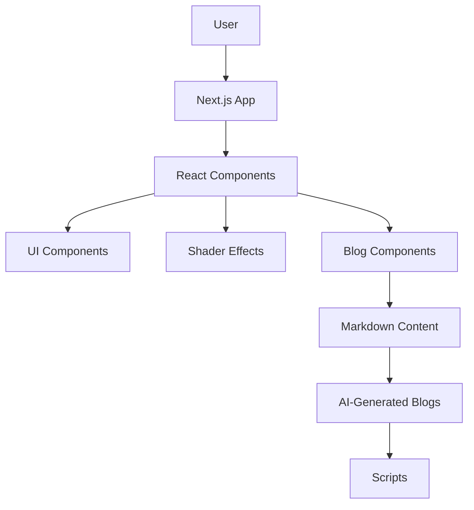

# Erfan Hassan — Digital Experience Architect & AI Workflow Strategist

[](LICENSE) [](CONTRIBUTING.md) [](https://nextjs.org/) [](https://www.typescriptlang.org/) [](https://react.dev/)

> **Crafting immersive digital experiences for global brands, powered by AI-driven workflows and cutting-edge web technologies.**

## 🌟 Why This Exists

In a world where digital attention is fleeting, brands need more than just a website—they need a **digital experience** that captivates, converts, and retains. This repository is the open-source core of my portfolio, showcasing how I blend **creative design** with **AI automation** to build high-impact solutions for global brands. It's a living blueprint for developers and designers who want to see how modern frameworks, shader effects, and AI content pipelines come together in production.

## ✨ Key Features

- **🎨 Immersive Visuals**: Leverages `@paper-design/shaders-react` for stunning, GPU-accelerated shader animations.
- **📝 AI-Powered Blog Engine**: Automated content generation for AI tools and business workflows (see `scripts/generate-daily-blog.mjs`).
- **🚀 Next.js 16 & React 19**: Built on the latest, fastest, and most scalable web technologies.
- **🛠️ TypeScript Throughout**: Type-safe codebase for maintainability and developer happiness.
- **📱 Responsive & Fluid**: Tailwind CSS v4 with `tw-animate-css` for buttery-smooth animations.
- **🔍 SEO-Optimized**: Structured content and metadata for maximum organic reach.
- **💬 Community-Ready**: Includes contribution guidelines, issue templates, and PR templates.

## 🛠️ Tech Stack & Architecture

| Layer | Technology |
|-------|------------|
| **Framework** | Next.js 16 (App Router) |
| **UI Library** | React 19, shadcn/ui, Base UI |
| **Styling** | Tailwind CSS v4, CSS Modules |
| **Animations** | Framer Motion, Paper Shaders |
| **Content** | Markdown (gray-matter), React-Markdown |
| **Language** | TypeScript 5 |
| **Tooling** | ESLint, PostCSS |



## 📦 Quickstart & Installation

Get the portfolio running locally in minutes:

```bash
# Clone the repository
git clone https://github.com/erfanhassan/erfanhassan.git

# Navigate into the project directory
cd erfanhassan

# Install dependencies
npm install

# Start the development server
npm run dev
```

Open [http://localhost:3000](http://localhost:3000) to see it in action.

### Generate AI Blog Content

```bash
# Generate a blog post on automation
npm run generate-blog -- --track=automation

# Generate a blog post on ecosystem
npm run generate-ecosystem
```

## 🖼️ Visual Proof


*Sequence frames showcase the immersive animations.*

## 🤝 Contributing & Community

Contributions are what make the open-source community such an amazing place to learn, inspire, and create. Any contributions you make are **greatly appreciated**.

- **Found a bug?** [Open an issue](.github/ISSUE_TEMPLATE/bug_report.md)
- **Have a feature request?** [Start a discussion](https://github.com/erfanhassan/erfanhassan/discussions)
- **Want to contribute?** Read the [Contributing Guidelines](CONTRIBUTING.md) and the [Code of Conduct](CODE_OF_CONDUCT.md).

Please adhere to the [Pull Request Template](.github/PULL_REQUEST_TEMPLATE.md) when submitting changes.

---

**Star this repo** ⭐ if you find it useful or inspiring! Your support helps grow the community.

## 📄 License

Distributed under the MIT License. See `LICENSE` for more information.

---

**Made with ❤️ by Erfan Hassan**