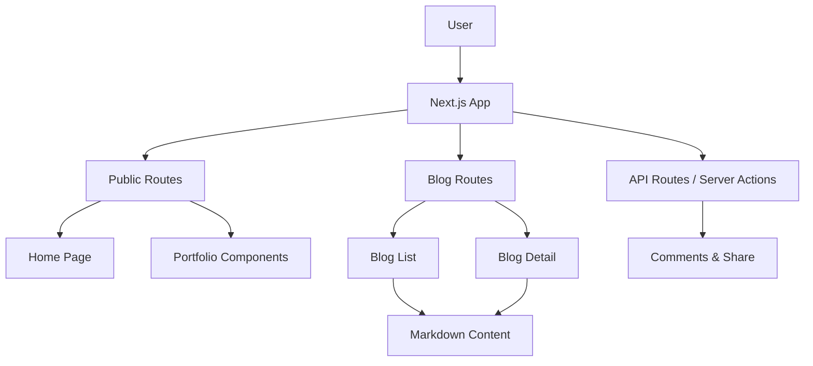

# Erfan Hassan — AI-Powered Digital Experience Portfolio & Blog

     

> A high-performance, AI-optimized portfolio and blog platform built with Next.js 16, React 19, and Tailwind CSS 4 — designed to showcase digital experiences and share insights on AI tools, automation, and business workflows.

## 🌟 Why This Exists

In a world where digital presence defines brand perception, Erfan Hassan's portfolio isn't just a collection of projects — it's a living showcase of how AI and modern web technologies can craft immersive, high-converting digital experiences. This repository serves as both a personal brand hub and a resource for developers and entrepreneurs seeking to leverage AI in their workflows.

## ✨ Key Features

- **🚀 Next.js 16 & React 19** — Blazing-fast performance with the latest App Router and server components.
- **🎨 Tailwind CSS 4** — Utility-first styling with a modern, responsive design system.
- **📝 Dynamic Blog Engine** — Markdown-based blog with daily generation scripts for AI, automation, and business topics.
- **🧠 AI-Focused Content** — Articles on high-ROI AI tools, AI executive assistants, and workflow automation.
- **🖼️ Visual Storytelling** — Custom shader effects, animated sequences, and a logo marquee for a premium feel.
- **🔍 SEO Optimized** — Built with semantic HTML, meta tags, and structured data for maximum discoverability.
- **💬 Community Engagement** — Blog comments and share buttons to foster interaction.
- **📱 Fully Responsive** — Seamless experience across all devices.

## 🛠️ Tech Stack & Architecture

| Layer | Technology |
|-------|------------|
| **Framework** | Next.js 16 (App Router) |
| **UI Library** | React 19 |
| **Styling** | Tailwind CSS 4, shadcn/ui, CVA |
| **Animation** | Framer Motion, @paper-design/shaders-react |
| **Content** | Markdown with gray-matter, react-markdown |
| **Icons** | lucide-react |
| **Language** | TypeScript 5 |

**Architecture Overview:**



## 📦 Quickstart & Installation

Get the project running locally in minutes:

```bash
# Clone the repository
git clone https://github.com/erfanhassan/erfanhassan.git

# Navigate to the project directory
cd erfanhassan

# Install dependencies
npm install

# Start the development server
npm run dev
```

Open [http://localhost:3000](http://localhost:3000) to see the result.

### Generate Blog Content

```bash
# Generate a blog post on automation track
npm run generate-blog

# Generate a blog post on ecosystem track
npm run generate-ecosystem
```

## 📸 Visual Proof


## 🤝 Contributing & Community

Contributions are what make the open-source community such an amazing place to learn, inspire, and create. Any contributions you make are **greatly appreciated**.

- Check out the [Contributing Guidelines](CONTRIBUTING.md)
- Please adhere to the [Code of Conduct](CODE_OF_CONDUCT.md)

## 📄 License

Distributed under the MIT License. See `LICENSE` for more information.

---

**Made with ❤️ by Erfan Hassan** — Building digital experiences for global brands.