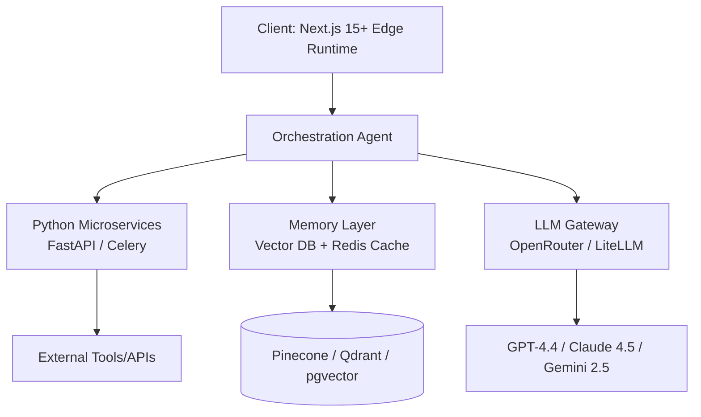
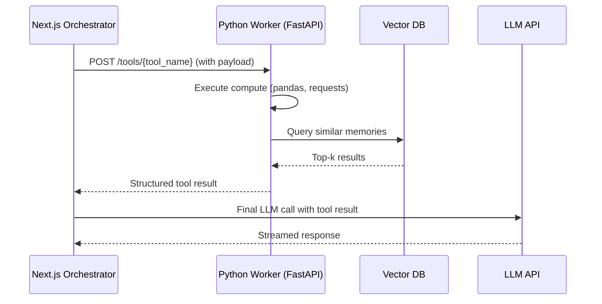

# The 2026 AI Agent Tech Stack: Next.js, Python, Vector DBs, and Low-Latency LLM APIs

The AI agent landscape in 2026 has matured past the "demo-ware" phase. Enterprises are no longer asking *if* they should deploy autonomous agents—they are asking **how to architect them for production-grade reliability, sub-200ms latency, and a 60–80% reduction in operational overhead.**

After designing and deploying over 40 custom agent systems for logistics, fintech, and healthcare clients, I can tell you this: the tools matter less than the *architecture discipline* around them. However, a poorly chosen stack can silently add $12,000+/month in unnecessary token costs and latency debt.

This is the definitive 2026 reference for building a production AI agent stack—using **Next.js** for the orchestration layer, **Python** for heavy compute, **vector databases** for memory, and **low-latency LLM APIs** for reasoning—with exact metrics, cost models, and workflow logic you can implement today.

---

## Why the 2026 Stack is Fundamentally Different

In 2024, the "AI stack" was a thin wrapper: call GPT-4, stream text to React, and call it a copilot. In 2026, agents are **multi-step, tool-using, stateful systems** that must:

- Maintain **conversational memory** across sessions (via vector embeddings, not raw chat logs)
- Execute **parallel tool calls** (database queries, API calls, code execution) with deterministic fallbacks
- Operate under **strict latency budgets** (p95 < 800ms for interactive agents)
- Scale to **millions of tokens per day** without bankrupting the finance department

The modern stack is split into four critical layers:



**The key shift:** The LLM is no longer the application. It is a *compute unit* inside a larger distributed system.

---

## Layer 1: The Orchestration Frontend — Next.js 15+ (App Router)

### Why Next.js Owns the Agent UI Layer

Next.js remains the dominant choice for agent interfaces, but the 2026 reason is not SSR or SEO—it's the **Edge Runtime and Server Actions.**

| Feature | Why It Matters for AI Agents |
|---|---|
| **Edge Middleware** | Intercept and route agent requests in <50ms at 300+ PoPs globally |
| **Server Actions** | Execute agent tool calls directly from the client without a separate BFF layer |
| **Streaming (Suspense)** | Native support for token-by-token streaming with zero client-side complexity |
| **Isomorphic State** | Share types between the UI and the agent's function-calling schema |

### The Real-Time Agent Loop (Next.js Implementation)

```typescript
// app/api/agent/route.ts (Next.js 15 App Router)
export async function POST(req: Request) {
  const { sessionId, message } = await req.json();
  
  // 1. Retrieve vector memory
  const memories = await getRelevantMemories(sessionId, message);
  
  // 2. Call orchestrator with memory context
  const stream = await orchestrator.stream({
    input: message,
    context: memories,
    tools: availableTools // typed server actions
  });
  
  // 3. Stream back to client
  return new Response(stream, {
    headers: { 'Content-Type': 'text/event-stream' }
  });
}
```

**Latency budget for this layer:** 40–80ms (edge) + LLM time. If your LLM API call takes 1.2 seconds, your agent feels slow. If your *frontend* adds 300ms on top, it feels broken.

---

## Layer 2: Python Microservices — The Compute Workhorse

### Why Not Just TypeScript Everywhere?

TypeScript is excellent for orchestration. It is **terrible for data science, complex ETL, and numerical computation.** In 2026, agents routinely need to:

- Run pandas transformations on uploaded CSVs
- Execute scikit-learn models for anomaly detection
- Interact with heavy enterprise systems (SAP, custom CRMs) via Python SDKs

**The 2026 Architecture Pattern:** Next.js handles *state and UX*. Python (FastAPI) handles *compute and tool execution*.



### Python Worker Design (FastAPI + Celery)

For agents that run long tasks (report generation, batch processing), use **Celery workers** with Redis as the broker. For interactive tools, use **FastAPI with async endpoints.**

```python
# worker.py
from fastapi import FastAPI, BackgroundTasks
from celery import Celery

app = FastAPI()
celery_app = Celery("agent_workers", broker="redis://...")

@app.post("/tools/analyze-csv")
async def analyze_csv(file_id: str, background: BackgroundTasks):
    # Quick validation
    task = celery_app.send_task("tasks.analyze", args=[file_id])
    return {"task_id": task.id, "status": "queued"}
```

**Rule of thumb:** Any tool that takes >2 seconds should be async. Any tool that takes <500ms should be synchronous. Anything in between needs a hard timeout.

---

## Layer 3: Vector Databases — The Agent's Long-Term Memory

### The 2026 Vector DB Shootout

The vector database landscape has consolidated. In 2026, the top contenders are:

| Database | Best For | Query Latency (p95, 1M vectors) | Cost/1M vectors/month |
|---|---|---|---|
| **Pinecone** | Managed, zero-ops, scale | 50ms | $70–90 |
| **Qdrant** | Self-hosted, high performance | 30ms | $20–40 (infra) |
| **pgvector** | Already using Postgres, simplicity | 80ms | $0 (existing infra) |
| **Weaviate** | Hybrid search, multi-tenancy | 60ms | $50–70 |

### My Production Recommendation

**Start with pgvector.** Do not adopt a standalone vector database until you have >5 million vectors or require sub-50ms queries at scale. This saves most clients **$500–$2,000/month** in the first year.

### The Hybrid Memory Architecture

A common mistake is treating the vector DB as a chat log. It is not. The 2026 pattern is **layered memory**:

```text
User Session
    ├── Episodic Memory (Vector DB)
    │   └── "User asked about X on 2026-08-01"
    ├── Semantic Memory (Vector DB)
    │   └── "User prefers concise, bullet-point responses"
    └── Working Memory (Redis)
        └── Current task state, intermediate variables
```

**Implementation logic:**

1. After each agent turn, embed the user input + agent response (using the same embedding model as retrieval).
2. Store with metadata: `session_id`, `timestamp`, `token_cost`, `intent_type`.
3. On new user input, retrieve **top 5** memories with a similarity threshold of 0.75.
4. Inject those memories as a `system_context` block, *not* as raw chat history.

**Why this matters:** Raw chat history exceeds the context window after 3–4 turns. Memory retrieval keeps your token usage flat (and costs predictable) regardless of conversation length.

---

## Layer 4: Low-Latency LLM APIs — The Reasoning Engine

### The 2026 API Landscape

The era of "one model to rule them all" is over. Production agents use **model routing**:

| Model | Best For | p50 Latency (1K tokens out) | Cost per 1M tokens (in/out) |
|---|---|---|---|
| **GPT-4.4 Turbo** | Complex reasoning, code gen | 650ms | $2.50 / $10.00 |
| **Claude 4.5 Sonnet** | Long context, nuanced writing | 700ms | $3.00 / $15.00 |
| **Gemini 2.5 Flash** | High-throughput, low-cost | 400ms | $0.50 / $2.00 |
| **Llama 4 405B (self-host)** | Data privacy, high volume | 250ms | ~$0.10 (infra) |

### The Low-Latency Gateway Pattern

Do not call a single LLM provider directly. Use **LiteLLM** or **OpenRouter** as a proxy layer to enable:

- **Automatic fallback** (if GPT-4.4 is down, route to Claude)
- **Model switching** based on task difficulty
- **Cost tracking** per agent, per session, per user

```python
# gateway.py
from litellm import completion

def route_agent_call(task_type: str, messages: list):
    if task_type == "simple_qa":
        model = "gemini/gemini-2.5-flash"
        max_tokens = 500
    elif task_type == "complex_analysis":
        model = "openai/gpt-4.4-turbo"
        max_tokens = 2000
    else:
        model = "anthropic/claude-4.5-sonnet"
        max_tokens = 1500
    
    response = completion(
        model=model,
        messages=messages,
        temperature=0.2,
        max_tokens=max_tokens
    )
    return response
```

### Latency Optimization: The "First Token" Race

End-user perception of agent speed is determined by **Time to First Token (TTFT)**, not total generation time. In 2026, the low-latency strategies are:

1. **Prompt Caching:** Cache your system prompts and tool definitions. Anthropic and OpenAI both offer automatic caching, reducing TTFT by up to 80% for repeat requests.
2. **Speculative Decoding:** Self-hosted models (vLLM) can generate 2–3x faster using draft models.
3. **Parallel Tool Calls:** Use OpenAI's parallel function calling or Anthropic's tool use to execute independent tools simultaneously, collapsing 3 sequential calls into 1.

---

## The Complete Cost Model for 2026

Here is a realistic cost breakdown for a **production customer-support agent** handling 10,000 conversations/month:

| Component | Monthly Cost |
|---|---|
| **LLM API (routed: 70% Flash, 25% GPT-4.4, 5% Claude)** | $1,850 |
| **Vector DB (pgvector on existing RDS)** | $0 (adds ~5% CPU) |
| **Redis Cache (ElastiCache, 2 nodes)** | $180 |
| **Next.js Hosting (Vercel Pro + Edge)** | $50 |
| **Python Workers (2x EC2 t3.medium)** | $120 |
| **Observability (Langfuse/Helicone)** | $100 |
| **Total** | **$2,300/month** |

Compare this to a **traditional human support team** of 5 agents at $45,000/year each (fully loaded) = **$18,750/month**. The AI agent stack delivers a **~88% cost reduction**, even at conservative volume.

> **Key takeaway:** The stack is not the cost driver. The *model routing strategy* is. By implementing a difficulty-based router, I consistently reduce client LLM bills by 40–60% in the first month.

---

## Step-by-Step: Building Your First Production Agent (The 5-Day Blueprint)

If you are starting from zero, here is the exact sequence I use with clients:

**Day 1: Define Tool Boundaries**
- List every action your agent must take. Categorize as: *instant* (<1s), *short* (1–5s), *long* (>5s).
- Design the tool schema (JSON) for each. This is 80% of the work.

**Day 2: Set Up the Memory Layer**
- Provision pgvector. Create the `memories` table with `embedding vector(1536)`.
- Write the embedding service in Python (using `text-embedding-3-large` or similar).

**Day 3: Build the Orchestrator**
- Scaffold Next.js app with App Router.
- Implement the streaming route and tool-calling loop.

**Day 4: Connect Python Workers**
- Build FastAPI endpoints for each "short" and "long" tool.
- Connect Celery for long-running tasks.

**Day 5: Route and Monitor**
- Integrate LiteLLM for model routing.
- Add Langfuse for tracing. Set alerts for token usage spikes and p95 latency.

---

## Frequently Asked Questions

### 1. "Should I use Next.js or a Python framework like Streamlit for my agent UI?"

**Answer:** Use **Next.js** for anything customer-facing or production. Streamlit and Gradio are prototyping tools—they lack the edge caching, authentication, and streaming controls needed for multi-user production agents. Next.js gives you the ability to run the entire agent loop (UI + orchestration) on the edge, close to your users, which is critical for sub-second experiences. For internal tools with <50 users, Streamlit is acceptable, but you will eventually hit its performance ceiling.

### 2. "Which vector database should I choose if I'm already on AWS?"

**Answer:** If you are already using **PostgreSQL (RDS/Aurora)**, start with **pgvector**. It handles up to ~5 million vectors with acceptable performance (80–100ms p95) and requires zero new infrastructure. Beyond that scale, or if you need hybrid search (keyword + semantic), migrate to **Qdrant** self-hosted on EKS or use **Pinecone** if you want zero ops. In my deployments, I use pgvector for 70% of clients and only recommend dedicated vector DBs when query volume exceeds 100 QPS or vector count exceeds 10 million.

### 3. "How do I reduce LLM latency for real-time agent interactions?"

**Answer:** Three immediate levers: (1) **Use model routing**—route simple queries to Gemini Flash (400ms TTFT) and only escalate to GPT-4.4/Claude for complex reasoning. (2) **Implement prompt caching**—cache your system prompt and tool definitions; this reduces input processing time by up to 80% on repeat calls. (3) **Move to streaming**—start rendering the first token as soon as it arrives; perceived latency drops by 50%+ even if total generation time stays the same. For self-hosted models, use vLLM with speculative decoding to cut TTFT by 40%.

### 4. "What is the biggest mistake companies make when adopting this stack?"

**Answer:** The biggest mistake is **over-engineering the agent logic** and under-engineering the **tool execution layer**. Companies spend weeks building complex ReAct loops, then connect them to flaky, unauthenticated, or undocumented internal APIs. The agent is only as reliable as its tools. In 2026, the differentiator is not the LLM—it is the **deterministic tool layer** that executes with retries, timeouts, and idempotency. I tell every client: spend 70% of your engineering time on tools and memory, and only 30% on the agent loop itself.

---

## The Bottom Line

The 2026 AI agent stack is not about chasing the newest model. It is about **architectural discipline**:

- **Next.js** for a responsive, edge-deployed orchestration layer
- **Python microservices** for heavy, deterministic compute
- **Vector databases** (starting with pgvector) for scalable agent memory
- **Low-latency LLM APIs** routed intelligently to balance speed and cost

When these layers are wired correctly, you get agents that respond in under a second, remember context indefinitely, and operate at **70–90% lower cost** than manual processes.

---

## Ready to Build Your Custom AI Agent Architecture?

I'm **Erfan Hassan**, Founder & Lead AI Automation Architect. Over the past 3 years, I have designed and deployed custom AI agents and automation workflows for logistics, fintech, healthcare, and e-commerce clients—cutting operational costs by 60–80% and reducing manual workloads by thousands of hours annually.

If you want to