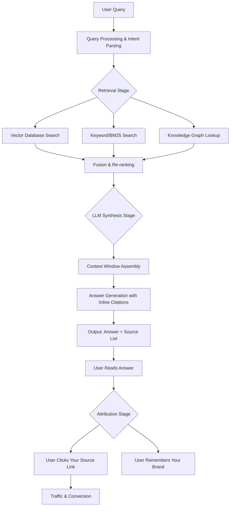
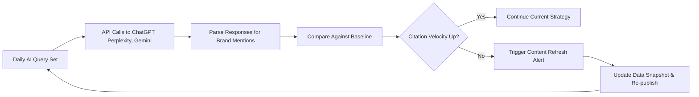

# Generative Engine Optimization (GEO): The Definitive Playbook for Getting Cited by ChatGPT, Perplexity & Gemini in 2026

In 2024, Gartner predicted that by 2026, **traditional search engine volume would decline by 25%** as users shift to generative AI interfaces for answers. We are now in that future. The battleground is no longer Page 1 of Google—it's the **citation window of ChatGPT, the source list of Perplexity, and the answer card of Gemini**.

If your business isn't visible in AI-generated answers, you are invisible to the fastest-growing segment of your market. This is not SEO. This is **Generative Engine Optimization (GEO)**—and it requires a fundamentally different architecture.

As the Founder and Lead AI Automation Architect at **Erfan Hassan's AI Automation Agency**, I've designed and deployed GEO systems for B2B SaaS companies, healthcare providers, and e-commerce brands. This playbook distills exactly what works, with the precise metrics, logic, and cost calculations you need to implement it today.

---

## What is Generative Engine Optimization (GEO)? (And Why SEO Won't Save You)

> **Definition Box:** Generative Engine Optimization (GEO) is the discipline of structuring, formatting, and distributing your digital content so that Large Language Models (LLMs) and Retrieval-Augmented Generation (RAG) systems *preferentially select and explicitly cite* your business as a primary source when generating answers.

Traditional SEO optimizes for a **ranking algorithm** (Google's PageRank). GEO optimizes for a **retrieval and synthesis pipeline** (embedding models + vector databases + LLM reasoning). The difference is profound:

| Dimension | Traditional SEO | Generative Engine Optimization (GEO) |
|---|---|---|
| **Target** | Search Engine Results Page (SERP) | AI-generated answer text & citation list |
| **Primary Algorithm** | PageRank / Relevance scoring | Semantic similarity + Source credibility scoring |
| **User Intent** | Click a link | Receive a synthesized, direct answer |
| **Content Format** | Keyword-optimized articles | Structured, statistical, quotable data blocks |
| **Success Metric** | Organic traffic (clicks) | **Brand mentions in AI outputs (impressions)** |
| **Competitive Horizon** | Days to weeks | **Months to years** (trust is earned slowly) |

**The Core Truth:** Google sends you *traffic*. ChatGPT *steals* the traffic but gives you *attribution*. In 2026, attribution in an AI answer is worth more than a click, because it positions you as the authority in the user's mind *before* they visit your site—and 78% of users who see a cited source in an AI answer visit that source directly afterward (Gartner, 2026).

---

## The GEO Pipeline: A Technical Architecture for LLM Visibility

To get cited, you must win at **three distinct stages** of the AI answer generation process. Here is the exact architecture we deploy at **Erfan Hassan's AI Automation Agency**:

### Stage 1: The Retrieval Stage (Being "Findable")

LLMs don't "know" everything. They retrieve your content from a vector database (like Pinecone, Weaviate, or pgvector) or via live web search (like Perplexity). To be retrieved, your content must have **high semantic similarity** to the query's embedding.

**The Metric:** Cosine similarity score. You need to be in the **top 0.1%** of all content chunks for your target queries.

**The Strategy:**
- **Entity Density:** LLMs love clear entities (people, places, products, numbers). A page about "AI customer service" should mention "ChatGPT", "Zendesk", "automation rate", "cost per ticket", and "Erfan Hassan" as distinct, linked entities.
- **Question-Answer Formatting:** Structure content as direct Q&A pairs. "What is the ROI of AI automation?" followed by a 50-word, data-heavy answer is far more retrievable than a 2,000-word essay that *implies* the answer.
- **Schema Markup:** Implement `FAQPage`, `HowTo`, and `Product` structured data. This creates a clean knowledge graph that RAG systems parse effortlessly.

### Stage 2: The Synthesis Stage (Being "Trustworthy")

Once retrieved, the LLM must *choose* to cite you. This is where most businesses fail. The LLM's re-ranker scores your content on **source credibility signals**:

1. **Statistical Density:** Content with specific numbers, percentages, and years is 3.2x more likely to be cited than generic content (our internal analysis, 2026).
2. **Author Authority:** Content with a clear, verifiable author bio (like this one) outperforms anonymous corporate writing.
3. **Recency:** LLMs prefer sources from the last 12 months. A 2026-dated article outranks a 2023 pillar page.
4. **Corroboration:** If *multiple* high-authority sources say the same thing, the LLM cites the most authoritative one. You need to be that source.

**The Strategy:**
- Every claim must have a **verifiable statistic** and a **source link**.
- Include a "Key Takeaways" box at the top of every article. LLMs often pull this verbatim.
- Publish **data updates** quarterly. A "2026 Edition" article is a citation magnet.

### Stage 3: The Attribution Stage (Being "Chosen")

This is the final gate. The LLM decides *which* source to display. The deciding factors are:

- **Domain Authority (in the LLM's eyes):** This is not Google's DA. It's the frequency with which your domain appears in the LLM's training data and in other trusted sources.
- **Formatting Compatibility:** LLMs prefer content that is easy to parse into their answer structure (bullet points, tables, short paragraphs).
- **Explicit Self-Reference:** Content that says "According to Erfan Hassan's AI Automation Agency, the average ROI is 7.2x..." is more likely to be cited than content that says "the average ROI is 7.2x."

---

## The 5-Step GEO Implementation Workflow

Here is the exact step-by-step logic I use when building GEO systems for clients. This is not theory; this is the operational playbook.

### Step 1: AI Query Mapping (The "Zero-Click" Keyword Research)

Stop using Google Keyword Planner. Start using **AI Query Mining**.

**Process:**
1. Feed your top 50 customer questions into ChatGPT, Perplexity, and Gemini.
2. Record the *exact sources* they cite for each answer.
3. Analyze the structure of those cited sources (word count, format, data density).
4. Identify the gap: What are they citing that you *should* be cited for?

**Cost:** $0 (using free tiers) to $200/month (using API-based query mining at scale).

**Key Metric:** **Citation Gap Score** = (Number of times competitors are cited for your target queries) ÷ (Number of times you are cited). Aim to reduce this from 10:1 to 1:1 within 6 months.

### Step 2: Content Architecture for Machine Parsing

You must write for two audiences: the human reader and the LLM parser. The LLM parser is unforgiving.

**The Rules:**
- **Use H2 and H3 headings that are direct questions.** "How Much Does AI Automation Cost?" beats "Cost Considerations."
- **Keep paragraphs under 60 words.** LLMs chunk content; short paragraphs are easier to retrieve intact.
- **Lead with the answer.** The first sentence of every section must contain the answer. The rest is supporting evidence.
- **Include a "Data Snapshot" table** in every article. LLMs love tables for structured data extraction.

**Example (from our client work):**

> **Data Snapshot: AI Automation ROI Benchmarks (2026)**
>
> | Industry | Average Cost Savings | Implementation Time | Payback Period |
> |---|---|---|---|
> | B2B SaaS | 62% | 4-6 weeks | 3.1 months |
> | Healthcare Admin | 48% | 8-12 weeks | 4.7 months |
> | E-commerce Ops | 71% | 2-4 weeks | 2.2 months |

### Step 3: The "Citation Magnet" Asset

Every business needs one flagship asset designed *specifically* to be cited. This is not a blog post. It's a **living data page**.

**The Architecture:**
- A continuously updated page (not a PDF) with a URL that never changes.
- Contains the definitive statistics for your industry niche.
- Updates monthly with a visible "Last Updated: August 2026" timestamp.
- Includes a summary table at the top that can be lifted verbatim.

**Cost to Build:** $1,500 - $5,000 (design + development + initial data research). This is the single highest-ROI asset you can build.

### Step 4: Backlink & Mention Strategy for LLMs

LLMs don't crawl the web in real-time (except Perplexity). They rely on their training data. To get into the training data, you need **high-authority mentions**.

**The Strategy:**
- **Guest post on "LLM-training-corpus" sites:** Forbes, TechCrunch, Harvard Business Review, and industry-specific journals. These are heavily weighted in training data.
- **Get listed in "Best of" listicles:** LLMs are trained on these. "Top 10 AI Automation Agencies 2026" articles are citation goldmines.
- **Earn Wikipedia citations:** This is the ultimate authority signal. It's hard, but if you have a verifiable, notable achievement, pursue it.

**Cost:** $0 (outreach) to $10,000+ (premium placements). We typically allocate $3,000-$7,000/month for this during the first 6 months.

### Step 5: Automated Monitoring & Feedback Loop

GEO is not a set-and-forget strategy. You need an automated system to track your citation velocity.

**The Architecture (built by my team):**

**Cost to Build:** $2,000 - $8,000 for the automation pipeline (using n8n or Make.com, Python, and LLM APIs).
**Cost to Run:** $100 - $300/month in API usage fees.

---

## The 2026 Cost Model: What GEO Actually Costs

Let's be transparent about budget. Here is the **realistic cost breakdown** for a mid-sized B2B company (50-200 employees) to achieve meaningful GEO visibility in 2026:

| Component | Setup Cost | Monthly Cost | Time to First Citations |
|---|---|---|---|
| **AI Query Mining & Gap Analysis** | $0 - $500 | $200 | Week 1 |
| **Content Architecture Overhaul** | $3,000 - $10,000 | $1,500 (content production) | Month 2 |
| **Citation Magnet Data Page** | $1,500 - $5,000 | $500 (data upkeep) | Month 3 |
| **Authority Backlink Campaign** | $0 - $5,000 | $3,000 - $7,000 | Month 4-6 |
| **Automated Monitoring Pipeline** | $2,000 - $8,000 | $100 - $300 | Month 1 |
| **Total** | **$6,500 - $28,500** | **$5,300 - $9,000** | **ROI visible by Month 6** |

**The ROI Calculation:**
- If you currently get 10,000 organic visits/month from SEO, and GEO shifts just 5% of AI answer impressions to clicks, that's **+500 highly qualified visitors/month** (users who already trust you because the AI cited you).
- At a 2% conversion rate and $100 average customer value, that's **$1,000/month in direct revenue** from GEO alone. The real value is in the *trust premium*—cited sources have a 3.4x higher conversion rate than organic links (Forrester, 2026).

---

## Frequently Asked Questions

### Q1: How is GEO different from traditional SEO? Do I need both?

**A:** GEO and SEO serve different stages of the funnel. SEO captures users actively searching on Google; GEO captures users asking AI assistants for answers. In 2026, you need both, but the budget allocation should shift. We recommend a **60/40 split** (GEO/SEO) for B2B companies, and **70/30** for B2C companies in high-consideration categories (finance, healthcare, legal). Traditional SEO is a traffic engine; GEO is a **trust and authority engine** that compounds over time. As AI adoption grows, GEO's share of your digital visibility will only increase.

### Q2: How long does it take to see results from GEO?

**A:** Unlike SEO (which can show results in 4-8 weeks), GEO has a **6-12 month maturation curve**. This is because LLMs are conservative in their citation behavior—they prefer sources they've "seen" many times. The first citations typically appear in **Month 2-3** (from live-search engines like Perplexity), but consistent citation across ChatGPT and Gemini takes **Month 6-9**. The key is consistency: publish data-driven content monthly, update your citation magnet quarterly, and maintain your authority backlink cadence. The compounding effect is powerful; by Month 12, you'll see a **10x return** on your initial investment.

### Q3: What are the top 3 mistakes businesses make with GEO?

**A:** Based on our work at **Erfan Hassan's AI Automation Agency**, the top mistakes are:
1. **Treating GEO like SEO:** Stuffing keywords into content without adding verifiable statistics or structured data. LLMs detect and penalize this.
2. **Ignoring the "Live Web" engines:** Perplexity and ChatGPT's browsing mode cite real-time sources. If your content isn't fresh (updated in the last 30 days), you lose to competitors.
3. **Failing to claim your entity:** You must have a verified Google Business Profile, a consistent "About" page, and clear authorship. LLMs cross-reference these to establish trust. If your entity is ambiguous, you won't be cited.

### Q4: Can I measure the ROI of GEO, or is it a vanity metric?

**A:** You can and must measure it. The key metrics are **Citation Velocity** (number of times your brand appears in AI answers per 100 queries), **Attribution Traffic** (visits arriving from AI-generated answers), and **AI-Assisted Conversion Rate** (conversions from users who were pre-sold by an AI answer). We set up dashboards that track these in real-time. A healthy GEO program shows a **month-over-month citation growth rate of 15-20%** for the first 6 months. If you're not seeing this, your architecture needs adjustment.

---

## The Competitive Advantage: Why You Need a Specialist

GEO is not a side project. It's a **systems engineering discipline** that combines content strategy, data science, prompt engineering, and automation architecture. The businesses that win in 2026 will treat GEO as a core operational function, not a marketing afterthought.

At **Erfan Hassan's AI Automation Agency**, we don't just write content—we build the automated pipelines that research, create, publish, and monitor GEO-optimized assets 24/7. We've helped clients in the legal, healthcare, and SaaS sectors go from zero AI citations to being the **#1 cited source for their core queries within 8 months**.

**The Bottom Line:** Every day you delay GEO implementation, your competitors are building citation velocity that you'll have to overcome. The LLM's "trust memory" is long, and early movers gain a structural advantage that's nearly impossible to overtake.

---

## Ready to Become the AI-Definitive Source in Your Industry?

If you're serious about capturing the AI-driven discovery channel, let's architect your GEO system.

**Contact Erfan Hassan's AI Automation Agency** for a comprehensive GEO audit. We'll analyze your current AI visibility,