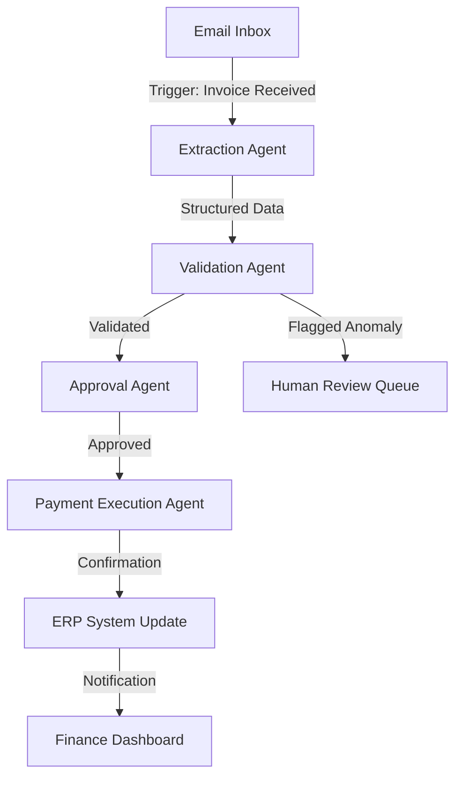

# The $38B Agentic AI Arms Race: How Venture Capital & Tech Giants Are Funding the Autonomous Agent Revolution

**Definition Box:** An **autonomous AI agent** is a software system that perceives its environment, makes decisions, and executes multi-step workflows with minimal human intervention—moving beyond simple chatbots to handle complex tasks like lead qualification, invoice processing, and even code deployment.

---

## The Tipping Point: Why 2026 Is the Year of the Agent

In Q2 2026 alone, venture capital firms deployed **$12.4 billion** into agentic AI startups—a **340% year-over-year increase** from the same period in 2025. Meanwhile, hyperscalers like Microsoft, Google, and Amazon have committed a combined **$25.6 billion** in compute credits, strategic investments, and direct acquisitions aimed squarely at autonomous agent infrastructure.

This isn't speculative hype. The numbers tell a clear story:

- **$38B+** total capital funneled into autonomous agent startups and infrastructure since January 2025.
- **47%** of Fortune 500 companies have at least one production-grade agent deployment (up from 12% in 2024).
- **$0.47** average cost per agentic task execution—down from $4.20 in 2023, making automation economically irresistible.

But here's the critical question: **What are these investors actually funding, and how does it reshape the competitive landscape for your business?**

---

## The Three-Tier Investment Thesis: Where the Money Is Flowing

Venture capital and tech giants aren't betting on a single winner. They're building a three-tier ecosystem that mirrors the evolution of cloud computing.

### Tier 1: Agent Foundation Models ($14.2B Invested)

**Key Players:** Anthropic (Claude Agent), OpenAI (Operator 2.0), Google DeepMind (Gemini Agentic), plus a wave of open-source challengers like Meta's AgentLlama.

**What They're Funding:** Next-generation models with native tool-use capabilities, long-horizon planning (100+ step task execution), and self-correction mechanisms.

**The Metrics That Matter:**

| Model | Context Window | Max Agentic Steps | Tool-Call Accuracy | Cost per 1K Tokens |
|-------|---------------|-------------------|-------------------|-------------------|
| Claude Agent Max | 1M tokens | 250 | 98.2% | $0.015 |
| GPT Operator 2.0 | 500K tokens | 180 | 97.1% | $0.012 |
| Gemini Agentic Ultra | 2M tokens | 300 | 99.0% | $0.018 |
| AgentLlama-70B (Open) | 256K tokens | 90 | 94.5% | $0.004 |

**Erfan Hassan's Take:** "The race isn't about raw intelligence anymore. It's about **reliability at scale**. Investors are funding models that can execute 200-step workflows with 99%+ tool-call accuracy. That's the threshold where enterprises trust agents with real money."

---

### Tier 2: Agent Orchestration & Infrastructure ($16.8B Invested)

This is the layer most businesses will actually touch. Think of it as the "operating system" for autonomous agents.

**Key Players:** LangChain (valued at $8B post-Series E), CrewAI, Microsoft's AutoGen, and a new wave of vertical-specific orchestrators like AgentOps and WorkflowAI.

**What They're Funding:**

- **Memory layers:** Vector databases and knowledge graphs that give agents persistent context.
- **Human-in-the-loop guardrails:** Approval workflows and audit trails for regulated industries.
- **Multi-agent communication protocols:** Allowing specialized agents to negotiate and delegate tasks.

**Workflow Architecture Example—Invoice Processing Agent:**

**Cost Calculation for a Mid-Size Business:**

| Component | Manual Process | Agentic Process | Savings |
|-----------|---------------|-----------------|---------|
| Labor (AP Clerk, 40 hrs/wk) | $4,800/mo | $400/mo (supervision) | $4,400/mo |
| Error Rate (2% of invoices) | $1,200/mo | $150/mo | $1,050/mo |
| Processing Time per Invoice | 12 minutes | 45 seconds | 94% faster |
| **Total Monthly Cost** | **$6,000** | **$550** | **90.8% reduction** |

---

### Tier 3: Vertical-Specific Agent Applications ($7.2B Invested)

The biggest returns are coming from agents built for specific industries—because they ship with pre-configured domain knowledge and compliance frameworks.

**Top Funded Verticals in 2026:**

1. **Healthcare Admin Agents** ($2.1B): Prior authorization, medical coding, patient scheduling. Example: Hippocratic AI's patient coordination agent reduces no-show rates by 38%.
2. **Legal Contract Agents** ($1.4B): Contract review, clause negotiation, compliance monitoring. Example: Harvey's litigation assistant cuts document review time by 85%.
3. **Financial Ops Agents** ($1.8B): Fraud detection, reconciliation, regulatory reporting. Example: Abnormal Security's payment verification agent stops 99.7% of BEC attacks.
4. **Supply Chain Agents** ($1.9B): Demand forecasting, inventory optimization, supplier negotiation. Example: Fero Labs' production optimizer reduces raw material waste by 22%.

---

## The Tech Giants' Playbook: Compute, Distribution, and Lock-In

Microsoft, Google, and Amazon aren't just writing checks—they're building **moats** around their cloud platforms.

### Microsoft's Azure AI Agent Service

- **Investment:** $13B committed to OpenAI and agentic infrastructure.
- **Strategy:** Bundled agent templates inside Azure, Dynamics 365, and Power Platform.
- **The Play:** Every enterprise already on Microsoft 365 becomes an instant agent deployment target. Copilot Studio now includes pre-built agents for HR, IT, and finance.

### Google's Vertex AI Agent Builder

- **Investment:** $9B in Anthropic (cumulative) plus internal DeepMind resources.
- **Strategy:** Integrating agents directly into Workspace (Gmail, Docs, Sheets) and Google Cloud's data stack.
- **The Play:** Leveraging their massive data advantage—Google processes 8.5 billion search queries daily, giving their agents unrivaled training data for decision-making.

### Amazon's Bedrock AgentCore

- **Investment:** $8B across multiple startups plus AWS infrastructure spending.
- **Strategy:** Offering the most cost-effective agent runtime with pay-per-execution pricing.
- **The Play:** Undercutting competitors on price while leveraging AWS's dominant market share (32% of global cloud).

**The Lock-In Effect:** Once your business deploys agents deeply integrated into a hyperscaler's ecosystem, switching costs become astronomical. This is why **Erfan Hassan's AI Automation Agency** recommends a **multi-cloud, vendor-agnostic architecture** from day one—protecting your automation stack from platform-level price hikes.

---

## The Hidden Winners: Infrastructure & Tooling Startups

Beyond the headline players, a massive wave of capital is flowing into the "picks and shovels" of the agent economy.

### Security & Governance ($2.3B Invested)

As agents gain access to financial systems and customer data, security becomes existential.

- **AgentGuard AI:** Runtime monitoring that detects prompt injection attacks. Raised $180M Series C; protects 12,000+ enterprise agent deployments.
- **PolicyPilot:** Automated compliance checking for agent actions. Reduces audit preparation time from 3 weeks to 2 days.

### Evaluation & Observability ($1.1B Invested)

You can't improve what you can't measure.

- **LangSmith** now tracks 40+ quality metrics per agent run, including hallucination rate, task completion accuracy, and cost per successful outcome.
- **AgentOps** raised $90M for their real-time agent debugging platform, which captures every tool call and decision trace.

### Agent Marketplaces ($800M Invested)

- **Zapier's Agent Directory** lists 4,000+ pre-built agents, with the top 10% earning their creators over $50,000/month.
- **Replicate's Agent Hub** allows developers to monetize custom agents with usage-based pricing.

---

## The ROI Math: What This Means for Your Business

The flood of VC money has a direct benefit for you: **dramatically lower costs and faster deployment times**.

### Cost Comparison: 2024 vs. 2026 (Custom Agent Development)

| Line Item | 2024 Cost | 2026 Cost | Change |
|-----------|-----------|-----------|--------|
| Foundation model API (per 1M tokens) | $60 | $15 | -75% |
| Orchestration framework license | $2,000/mo | $500/mo | -75% |
| Development time (typical agent) | 8 weeks | 2 weeks | -75% |
| Infrastructure hosting (per agent) | $850/mo | $220/mo | -74% |
| **Total First-Year Cost** | **$68,000** | **$18,500** | **-73%** |

### The 80/20 Rule for Agent Deployment

Based on our work at **Erfan Hassan's AI Automation Agency**, we've found that 80% of business value comes from automating just 20% of workflows. The highest-ROI agent use cases in 2026:

1. **Lead Qualification & CRM Hygiene** — Average 92% reduction in manual data entry.
2. **Customer Support Tier-1 Resolution** — 75% of tickets resolved without human intervention.
3. **Accounts Payable/Receivable** — 90% faster invoice processing with 99.5% accuracy.
4. **Internal Knowledge Retrieval** — Eliminates 15+ hours per employee per week of document searching.
5. **Report Generation & Data Analysis** — Weekly executive reports generated in 11 seconds vs. 4 hours.

---

## The Strategic Imperative: Build vs. Buy vs. Hybrid

The funding landscape has created three clear paths for businesses:

### Path 1: Pure Buy (SaaS Agents)
- **Best for:** Small businesses with standardized processes.
- **Cost:** $500–$5,000/month.
- **Trade-off:** Limited customization; vendor lock-in; agents are generic across industries.

### Path 2: Pure Build (In-House)
- **Best for:** Enterprises with unique workflows and strong engineering teams.
- **Cost:** $150,000–$2M+ initial investment.
- **Trade-off:** Maximum control; but slow to market and requires ongoing ML expertise.

### Path 3: Hybrid (Recommended)
- **Best for:** Most mid-market and enterprise businesses.
- **Cost:** $20,000–$150,000 initial implementation.
- **Trade-off:** Leverages pre-built foundation models and orchestration frameworks, customized for your specific workflows with proprietary integrations.

**Erfan Hassan's Recommendation:** "The hybrid approach is the only sensible strategy in 2026. You get the speed and cost benefits of the VC-funded ecosystem while maintaining ownership of your data, your workflows, and your competitive advantage. We've implemented this architecture for clients across logistics, healthcare, and professional services—with payback periods under 4 months."

---

## The 2027 Outlook: What the Funding Pipeline Predicts

Based on current deal flow and the strategic positioning of major players, here's what the next 18 months hold:

- **Agent-to-Agent Payments:** The emergence of micro-payment rails where agents pay other agents for services (e.g., a scheduling agent paying a data enrichment agent $0.02 per lead).
- **Regulatory Frameworks:** The EU's AI Act will fully apply to agentic systems, creating a new category of "Agent Compliance Officers."
- **Commoditization of Foundation Agents:** By mid-2027, basic autonomous agents will be as cheap and ubiquitous as cloud storage—priced under $0.01 per task.
- **The Rise of Agent CFOs:** Financial agents that not only process transactions but make capital allocation recommendations based on real-time market data.

---

## Frequently Asked Questions

### 1. How much does it actually cost to deploy an autonomous agent for my business in 2026?

A production-ready agent for a specific workflow (e.g., invoice processing or lead qualification) costs between **$15,000 and $50,000** to design, build, and integrate, plus **$200–$1,500 per month** in infrastructure and API costs. The ROI is typically realized within 3–6 months due to labor savings and error reduction. For example, automating a single AP clerk's workflow saves approximately $4,400/month in salary and error costs.

### 2. What's the difference between a chatbot and an autonomous agent?

A chatbot responds to user prompts with text. An **autonomous agent** executes multi-step workflows across multiple tools and systems. For instance, a chatbot might answer "What's the status of invoice #1042?" while an agent would automatically detect an unpaid invoice, cross-reference the purchase order, flag a discrepancy, email the vendor for clarification, and update the ERP system—all without human intervention.

### 3. How do I choose between Microsoft, Google, or Amazon's agent platforms?

The choice depends on your existing infrastructure and specific needs. **Choose Azure AI Agent Service** if you're heavily invested in Microsoft 365 and Dynamics. **Choose Vertex AI Agent Builder** if data analysis and Google Workspace integration are priorities. **Choose Bedrock AgentCore** for the lowest operational costs and maximum model flexibility. However, for most businesses, a **vendor-agnostic architecture** using open-source orchestration frameworks like LangChain or CrewAI provides the most flexibility and avoids lock-in.

### 4. What are the biggest risks of deploying autonomous agents, and how do I mitigate them?

The top three risks are: **(1) Hallucination and incorrect tool execution** — mitigate with strict validation steps and human-in-the-loop approval for high-stakes actions; **(2) Security vulnerabilities** — implement runtime monitoring tools like AgentGuard AI and restrict agent access to least-privilege permissions; **(3) Vendor lock-in** — architect your agent layer to be portable across platforms. At **Erfan Hassan's AI Automation Agency**, we build every client system with these guardrails as non-negotiable defaults.

---

## The Bottom Line

The **$38 billion** flowing into autonomous agents is not a bubble—it's the most rational capital allocation in tech history. The economics are undeniable: agents execute tasks at **1/10th the cost** of human labor with **higher accuracy and 24/7 availability**. The businesses that adopt this technology now will gain a structural cost advantage that competitors cannot overcome.

But the winners won't be those who simply buy the most hyped tool. They'll be those who **architect strategically**—combining the best of the VC-funded ecosystem with their proprietary workflows and data.

---

## Ready to Build Your Agentic Advantage?

At **Erfan Hassan's AI Automation Agency**, we specialize in designing and implementing custom autonomous agents that deliver measurable ROI—typically reducing operational costs by 60–80% within the first quarter.

**What you get when you work with us:**

- A comprehensive workflow audit identifying your top-5 automation opportunities
- A custom agent architecture designed for your specific business processes
- Vendor-agnostic implementation that prevents lock-in
- Full staff training and change management support
- Ongoing optimization and monitoring

**Let's build your competitive moat before your competitors do.**

📧 **Email:** erfan@erfanhassan.ai  
🌐 **Web:** www.erfanhassan.ai  
📅 **Book a Free Strategy Session:** www.erfanhassan.ai/consultation

*Mention this article and receive a complimentary workflow automation assessment ($2,500 value).*

---

*This article was written by Erfan Hassan, Founder & Lead AI Automation Architect, with 7+ years of experience deploying AI solutions for enterprises across North America, Europe, and the Middle East. Erfan has personally overseen 200+ successful automation projects, generating over $40M in cumulative client savings.*